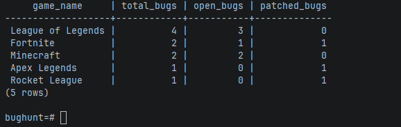
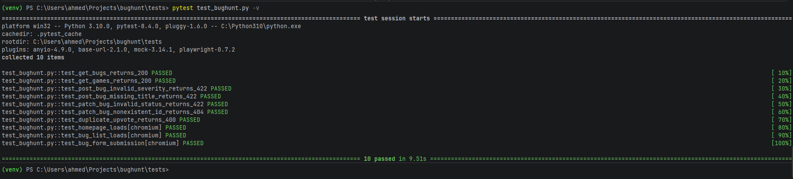
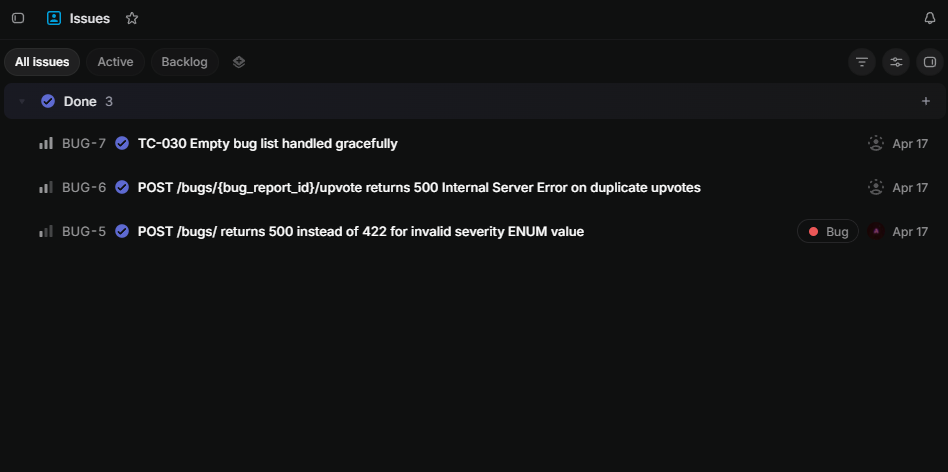

# BugHunt — Crowdsourced Game Bug Reporting Platform

BugHunt is a full-stack web application where gamers can submit bug reports 
for their favorite games, upvote issues other players have found, and track 
whether developers have patched them. It features a public bug reporting 
dashboard, an admin triage panel, and an analytics dashboard (all reflecting 
real-time data from a PostgreSQL database).

Built from a QA engineer's perspective: I wrote a formal test plan, executed 
30 manual test cases, logged 2 defects in Linear with full defect lifecycle 
documentation, and built an automated regression suite using Playwright and 
pytest that runs 10 critical user flows in under 10 seconds.

---

## Table of Contents

- [Tech Stack](#tech-stack)
- [Features](#features)
- [Architecture](#architecture)
- [Getting Started](#getting-started)
- [Database Schema](#database-schema)
- [API Endpoints](#api-endpoints)
- [SQL Analytics Queries](#sql-analytics-queries)
- [Test Plan & QA Artifacts](#test-plan--qa-artifacts)
- [Automated Test Suite](#automated-test-suite)
- [Defect Log](#defect-log)
- [Known Limitations](#known-limitations)

---

## Tech Stack

| Layer | Technology |
|---|---|
| Frontend | React (Vite) |
| Backend | Python, FastAPI |
| Database | PostgreSQL 16 |
| Containerization | Docker, Docker Compose |
| Testing | pytest, Playwright |
| Defect Tracking | Linear |
| Version Control | Git, GitHub |

---

## Features

- **Bug Report Submission** — submit bug reports with title, description, 
  severity, steps to reproduce, and platform
- **Upvoting System** — upvote bug reports with duplicate prevention enforced 
  at the database level
- **Admin Triage Panel** — update bug statuses (open, confirmed, patched) 
  with real-time reflection across all views
- **Analytics Dashboard** — powered by raw SQL queries showing top reported 
  games, severity breakdown, platform breakdown, and weekly bug volume
- **REST API** — 6 endpoints documented and testable via Swagger UI at 
  `/docs`

---

## Architecture
React Frontend (Vite) | FastAPI Backend | PostgreSQL (Docker) :5173:8000:5432

---

## Getting Started

### Prerequisites
- Docker Desktop
- Node 18+
- Python 3.11+

### Setup

1. Clone the repository:
```bash
git clone https://github.com/aballal-source/bughunt.git
cd bughunt
```

2. Create your `.env` file:
```bash
cp .env.example .env
```

3. Start the database:
```bash
docker compose up
```

4. Start the backend:
```bash
cd backend
python -m venv venv
venv\Scripts\activate  # Windows
pip install -r requirements.txt
uvicorn main:app --reload
```

5. Start the frontend:
```bash
cd frontend
npm install
npm run dev
```

6. Open http://localhost:5173

API documentation available at http://127.0.0.1:8000/docs

---

## Database Schema

Four tables with proper constraints, foreign keys, and ENUM types:

- **users** — `user_id`, `username`, `user_email`, `user_password`, 
  `is_admin`, `created_at`
- **games** — `game_id`, `game_name`, `created_at`
- **bug_reports** — `bug_report_id`, `user_id` (FK), `game_id` (FK), 
  `title`, `description`, `severity` (ENUM), `steps_to_reproduce`, 
  `platform`, `status` (ENUM), `created_at`
- **upvotes** — `upvote_id`, `user_id` (FK), `bug_report_id` (FK), 
  `created_at`, `UNIQUE(user_id, bug_report_id)`

---

## API Endpoints

| Method | Endpoint | Description |
|---|---|---|
| GET | `/bugs/` | Get all bug reports with upvote counts |
| POST | `/bugs/` | Submit a new bug report |
| PATCH | `/bugs/{id}/status` | Update bug report status (admin) |
| POST | `/bugs/{id}/upvote` | Upvote a bug report |
| GET | `/games/` | Get all games |
| POST | `/games/` | Add a new game |
| GET | `/analytics/` | Get analytics data |

Full interactive documentation: http://127.0.0.1:8000/docs

---

## SQL Analytics Queries

The analytics dashboard is powered by raw SQL queries. Example:



**Most reported games:**
```sql
SELECT 
    g.game_name,
    COUNT(br.bug_report_id) AS total_bugs,
    COUNT(CASE WHEN br.status = 'open' THEN 1 END) AS open_bugs,
    COUNT(CASE WHEN br.status = 'patched' THEN 1 END) AS patched_bugs
FROM games g
LEFT JOIN bug_reports br ON g.game_id = br.game_id
GROUP BY g.game_name
ORDER BY total_bugs DESC;
```

**Bugs reported in the last 7 days:**
```sql
SELECT COUNT(*) 
FROM bug_reports 
WHERE created_at >= NOW() - INTERVAL '7 days';
```

---

## Test Plan & QA Artifacts

| Artifact | Location |
|---|---|
| Test Plan | `/docs/test_plan.md` |
| Manual Test Cases (31) | `/docs/test_cases.md` |
| Automated Test Suite | `/tests/test_bughunt.py` |
| Defect Log | `/docs/defect_log.pdf` |

**Manual Test Execution Results:**
- 28 Passed
- 2 Failed → Fixed → Retested and Passed
- 1 Skipped (destructive test, requires isolated environment)

---

## Automated Test Suite

10 automated tests covering critical user flows using Playwright and pytest:
pytest tests/test_bughunt.py -v
test_get_bugs_returns_200           PASSED
test_get_games_returns_200          PASSED
test_post_bug_invalid_severity      PASSED
test_post_bug_missing_title         PASSED
test_patch_bug_invalid_status       PASSED
test_patch_bug_nonexistent_id       PASSED
test_duplicate_upvote_returns_400   PASSED
test_homepage_loads                 PASSED
test_bug_list_loads                 PASSED
test_bug_form_submission            PASSED
10 passed in 9.51s

---

---

## Defect Log

2 defects discovered and resolved during manual testing:

| ID | Title | Severity | Status |
|---|---|---|---|
| DEF-001 | POST /bugs/ returns 500 instead of 422 for invalid severity ENUM | Medium | Resolved |
| DEF-002 | Duplicate upvote returns 500 instead of 400 | Medium | Resolved |



Full defect log with steps to reproduce and resolution details: 
`/docs/test_cases.md`

## Known Limitations

- Authentication is not implemented — user identity is hardcoded for 
  demonstration purposes
- Admin access is controlled by a boolean flag in the frontend, not 
  server-side authentication
- TC-030 (empty state test) requires an isolated test database to avoid 
  destroying development data
